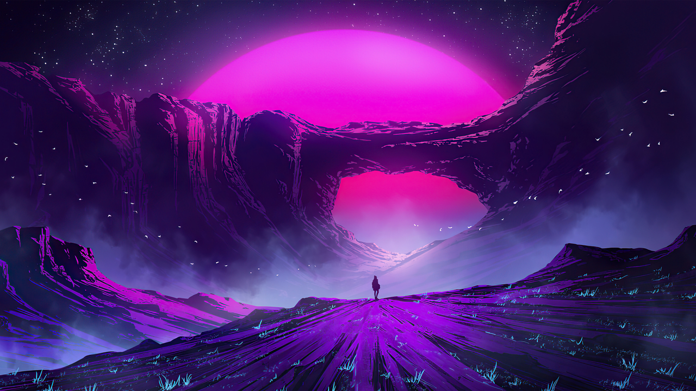
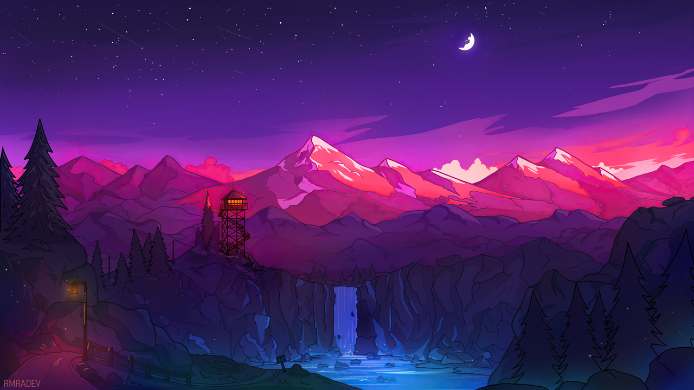
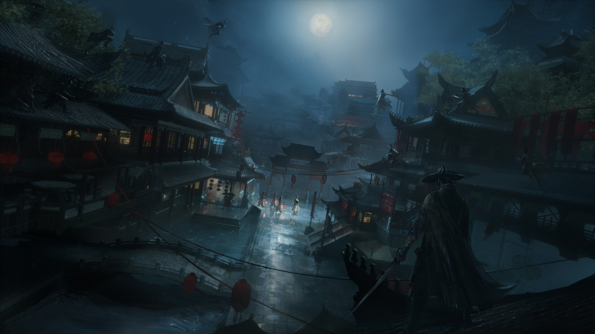

# Miroir — Omarchy themes + multi-app theming

A theme family for [Omarchy](https://omarchy.org) (violet-dominant, cyan/green accents, deep
blacks) that doesn't stop at the terminal: one `omarchy-theme-set` re-themes Discord, Spotify,
GTK/Qt apps, tmux, your browser — and even a Razer keyboard.

Four themes, one taste profile, four moods:

| | |
|---|---|
| **Miroir Hack** — neon hack, scanlines | **Miroir Void** — deep space, nebula |
|  |  |
| **Miroir Grimoire** — arcane, serif & gold | **Miroir Shinkai** — painted skies |
|  |  |

## Install

```bash
git clone https://github.com/Voyd-star/omarchy-miroir.git
cd omarchy-miroir
bash install.sh
```

The installer is **interactive** — it asks per feature and only touches what you accept:

| Feature | What it does |
|---|---|
| Theme(s) | Copies the theme into `~/.config/omarchy/themes/` (native Omarchy theming: terminal, waybar, mako, walker, btop, neovim, hyprlock, VS Code…) |
| Hyprland look-n-feel | Window motions/deco + border gradient & shadow glow that follow the theme accent (your current `looknfeel` is backed up) |
| Wallpaper rotation | systemd user timer cycles the theme's `backgrounds/` hourly |
| Shibumi bar | [HANCORE's Shibumi Shell](https://github.com/HANCORE-linux/Shibumi-Shell) (native Quattro bar + 24-plugin suite), **vendored & pinned**, accent wired to the theme accent (Omarchy 4.x only) |
| Theming framework | Hook framework re-theming apps on every theme change (`~/.config/omarchy/hooks/theme-set.d/`) |
| ├─ Discord | Vesktop + base16 theme generated from the palette (`Ctrl+R` to reload) |
| ├─ Spotify | spicetify skin with a **personality per theme** + 3 toggleable modes: **Zen** `Ctrl+Alt+Z`, **Ambience** `Ctrl+Alt+A` (cover-art glow, on by default), **Vinyl** `Ctrl+Alt+V` (spinning cover) |
| ├─ Razer | Keyboard LED = theme accent (openrazer + polychromatic) |
| ├─ tmux | Statusbar colors from the palette |
| └─ Extra hooks | GTK, Qt6, fish, fzf, firefox, zen, qutebrowser, zed, cava, typora, superfile, vicinae, heroic, nwg-dock — each one no-ops if the app isn't installed |

Non-interactive: `bash install.sh --all` (everything) or `bash install.sh --theme-only`.

Then:

```bash
omarchy-theme-set "Miroir Hack"    # or Void / Grimoire / Shinkai
```

## How it works

- **Theme**: each theme is a standard Omarchy theme (`colors.toml` + `backgrounds/` +
  per-app files) — Omarchy natively generates terminal/waybar/mako/walker/btop/etc from it.
- **Framework**: `~/.config/omarchy/hooks/theme-set` reads the active theme's `colors.toml`,
  exports the 16-color palette and runs every executable in `theme-set.d/`. Omarchy 4.x no
  longer calls hooks natively, so a systemd **path unit** (`miroir-theme-apply.path`) watches
  `current/theme.name` and re-runs everything on theme change. On 3.x, Omarchy runs the hooks
  itself and the dispatcher's double-run is guarded.
- **Feature toggles**: the installer writes `~/.config/miroir/features.conf`
  (`MIROIR_RAZER/TMUX/HYPR=0|1`) — flip them any time, no reinstall needed.

## Omarchy 4.x vs 3.x

`install.sh` detects your version (`omarchy-version`) and deploys the matching Hyprland
variant: `looknfeel.lua` (4.x, lua config) or `looknfeel.conf` (3.x, hyprlang). Both source a
live `miroir-theme.{lua,conf}` regenerated on each theme change so borders/shadows track the
accent.

## Shibumi bar (vendored)

The bar is [Shibumi Shell](https://github.com/HANCORE-linux/Shibumi-Shell) by
HANCORE — the successor of QS Rise, running as a plugin suite **inside**
Omarchy Quattro's native shell process. It is **vendored** in
`vendor/shibumi-shell/` at a pinned, audited commit (see its `VENDOR.md`): the
installer never pulls live upstream code, so a compromised upstream push can't
reach your machine. The installer sets the bar accent to the semantic role
`color05` — the Miroir accent — so every theme switch recolors the bar
automatically. Uninstall/restore the stock bar any time:

```bash
cd vendor/shibumi-shell && ./scripts/shibumi-suite uninstall --yes
```

## Disabled-by-default hooks

`theme-set.d/*.disabled`: VS Code / Cursor / Windsurf (heavy, redundant with Omarchy's native
VS Code theming). Rename to `.sh` + `chmod +x` to re-enable, at your own risk.

**No Steam theming** — it was tried (Adwaita-for-Steam) and dropped: it intermittently
regenerates a broken CSS that paints black rectangles over the Steam UI. Steam's default
dark theme fits the themes fine.

## Good to know

- **Spotify updates** reset `/opt/spotify` ownership to root and the skin disappears:
  ```bash
  sudo chown -R "$USER" /opt/spotify && spicetify backup apply
  ```
- **Razer**: first install needs a reboot (dkms module) before the LED reacts.
- **Wallpaper rotation** uses `KillMode=process` — without it the oneshot service kills
  swaybg on exit and the wallpaper vanishes.
- Test a Spotify personality without switching desktop theme:
  `MIROIR_SPOTIFY_THEME_OVERRIDE=miroir-hack` + palette exports.

## Uninstall

```bash
rm -rf ~/.config/omarchy/themes/miroir-* ~/.config/miroir
rm -f ~/.config/omarchy/hooks/theme-set ~/.config/omarchy/hooks/theme-set.d/*
rm -f ~/.local/bin/miroir-theme-apply
systemctl --user disable --now miroir-theme-apply.path omarchy-bg-rotate.timer 2>/dev/null
rm -f ~/.config/systemd/user/{miroir-theme-apply.{path,service},omarchy-bg-rotate.{service,timer}}
omarchy-theme-set tokyo-night   # or any built-in theme
```

## License

Scripts and theme files: MIT. Wallpapers are collected from the web (wallhaven) and remain
the property of their authors — if one of yours is here and you want it removed, open an issue.
